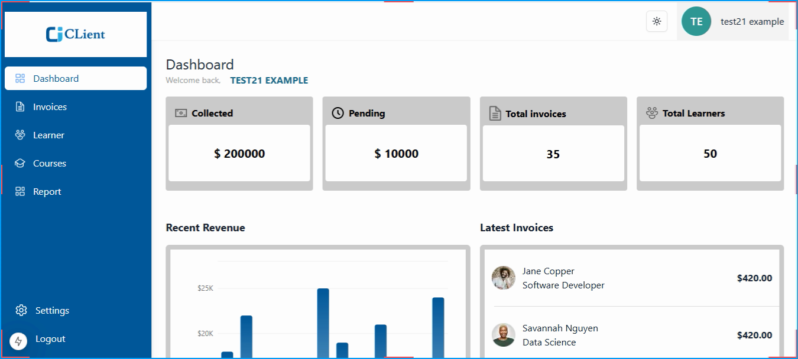
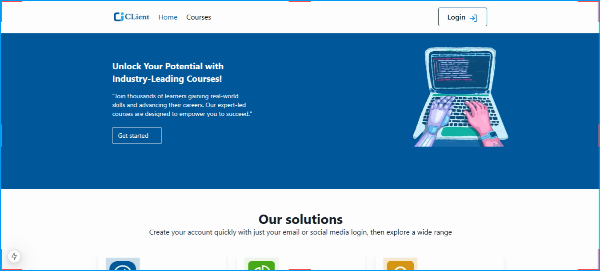

# Learner Management System

A robust learner management system built with [Next.js](https://nextjs.org/) and styled using [Tailwind CSS](https://tailwindcss.com/). 





## Features

- **User Authentication:** Secure login and registration for learners and administrators. Includes support for role-based access control (RBAC) to ensure data privacy and security.

- **Google Sign-up/Sign-in**: Learners can conveniently sign up or log in using their Google accounts.
**Sign-Up Verification**: Enhanced security with sign-up authentication for learner and admin accounts to protect sensitive data.
 
- **Admin Controls**:
- **Empower administrators with robust management tools**:

 *Learner Management* : Admins can create, update, and delete learner profiles as needed.

*Invoice Management*: Admins can generate, track, and manage invoices for paid courses. Easily monitor payment statuses (Paid/Pending) and resolve discrepancies.

*Course Management*: Admins can generate, track, create and manage courses for paid courses. 

- **Responsive Design:** Fully responsive UI for a seamless experience on desktop and mobile devices.


## Technologies Used

- **Next.js:** For building a fast and SEO-friendly web application.
- **Tailwind CSS:** For modern, utility-first styling.
- **Shadcn:** For Dashboard, utility-first styling.
- **React:** For building interactive UI components.
- **Other Tools/Libraries:** ( Redux Toolkit, NextAuth, React Query.)

## Getting Started

### Prerequisites

- Node.js (v14 or later)
- npm or yarn

### Installation

1. **Clone the Repository**

   ```bash
   git clone https://github.com/benedictben/lms-g-client.git
   cd learner-management-system
   ```

2. **Install Dependencies**

   Using npm:
   ```bash
   npm install
   ```
   Or using yarn:
   ```bash
   yarn install
   ```

3. **Configure Environment Variables**

   Create a `.env.local` file at the root of your project and add the required environment variables. 
  

4. **Run the Development Server**

   Using npm:
   ```bash
   npm run dev
   ```
   Or using yarn:
   ```bash
   yarn dev
   ```

   Open [http://localhost:3000](http://localhost:5173) to view it in the browser.

## Deployment

You can deploy this Next.js application on platforms like [Vercel](https://vercel.com/) or [Netlify](https://www.netlify.com/). Follow the respective guides for deploying Next.js applications.

## Contributing

Contributions are welcome! Please read the [contribution guidelines](CONTRIBUTING.md) for more information on how to contribute to this project.

## License

This project is licensed under the MIT License. See the [LICENSE](LICENSE) file for details.

## Contact

For questions or feedback, please contact [benbenedict26@yahoo.com](mailto:benbenedict26@yahoo.com).

---

